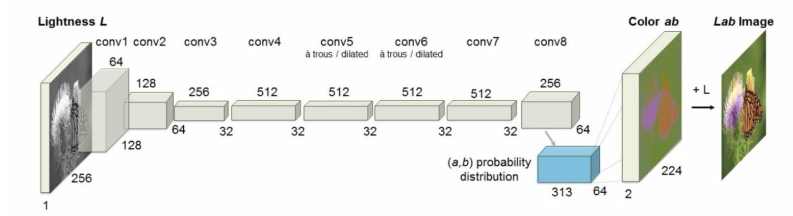
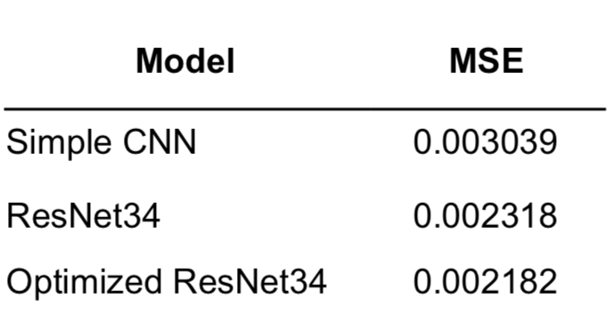
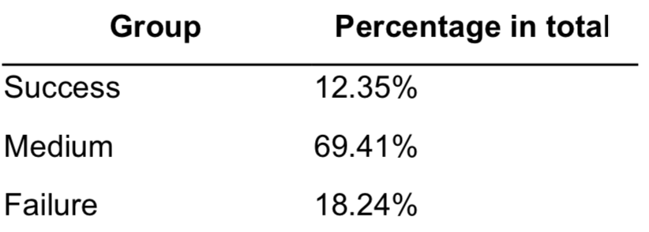
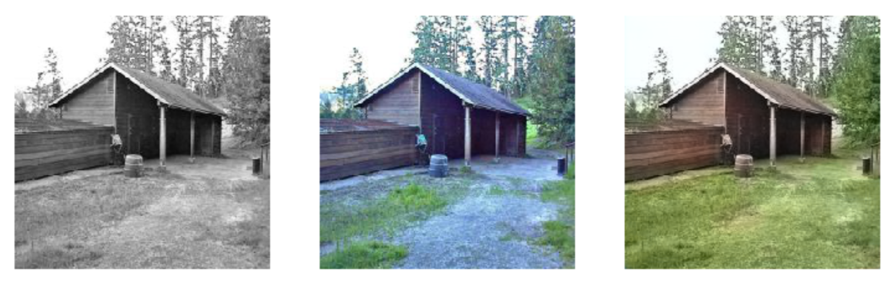
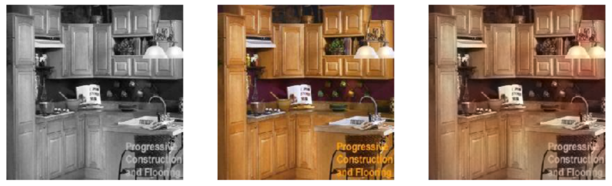
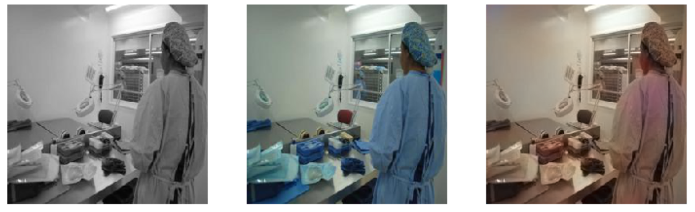

# Image Colorization
Team members: Zhentao Hou, Xuxu Pan

# Abstract
In this paper, we developed a Convolutional Neural Network (CNN) model to colorize grayscale images. We built the model by fine-tuning the pretrained ResNet34 model and achieved a mean squared error (MSE) of 0.002182 on the validation dataset. Some of our predicted images even surpass the ground truth images in terms of color quality. Our model performs well at predicting green and blue colors, such as colorizing the grass, sky and ocean, but it does not perform well at predicting yellow and red. One possible reason could be that the majority of images contain large areas of blue and green, and there are less red and yellow colors. As a next step, we can train our model with a larger dataset and upsample red and yellow colors to improve the model performance.

# Problem Description
Image colorization is a technique that turns a grayscale image into a colored one. It has many potential applications, such as adding color to historical images or videos that were originally taken in black and white or improving the color quality of images. Since manually colorizing images is expensive and time-consuming, automated image colorization has been a popular subject in computer vision. However, this task is very challenging as a single grayscale image could correspond to multiple plausible colored images. In recent years, neural network models have achieved great success in this area. Here, we aim to develop CNN models to predict the corresponding colors of a grayscale image.

# Data
Data Source: ​http://places2.csail.mit.edu/download.html
We used the data of Places365-Standard from MIT and chose small images of size 256x256 for simplicity. The original dataset contains millions of images from 365 scene categories. Due to the limitation of time and computing resources, we only used 36,500 images from the dataset to train our model.

# Previous Work
Link: ​https://github.com/richzhang/colorization
We built our model based on the code linked above. Our model differs from the previous work in the following areas:
1. The previous work trained their model on ImageNet while we trained our model on the Places dataset.
2. The previous work used a single-stream, VGG-styled neural network with added depth and dilated convolutions. We used the pretrained ResNet34 model and added more convolutional layers.
3. The previous work treated the color prediction as a multiclass classification problem and divided the ​ab color channels into 313 classes. Our model directly predicted the values of the ​ab​ color channels, i.e., a regression problem.

# Methods
For the colorization problem, our goal is to predict the corresponding colors given a grayscale image. In order to train our model, we first converted color images from RGB colorspace to CIE Lab colorspace. In the Lab colorspace, color is expressed as three values: lightness (-100 to 100), ​a color channel from green to red (-128 to 127), and ​b color channel from blue to yellow (-128 to 127). Here, lightness is taken as the input of our model and the values of the ​ab color channels are the model output/prediction.

The transformation process is incorporated in our dataset object. The Lab data is separated into two arrays, one containing the lightness value (x) and the other containing the ​ab color channel values (y). We also found that there are both grayscale and color images in the dataset. Since grayscale images only have 1 channel, we need to filter them out so that they don’t break the modeling pipeline. After excluding all grayscale images from our dataset, we can load the image data to train our model.

As a starting point, we built a simple CNN model with 6 convolutional blocks, where each block consists of a 3x3 convolution layer, a Relu layer, and a BatchNorm layer. The neural network architecture is adapted from the previous work, as shown below. We did not implement the two dilated convolutional layers. In our model, the first 5 blocks were used to extract features from the images and the output size after the 5th block is (batch size, 512, 32, 32). Then, we used upsampling with a scale factor of 8 to achieve spatial changes in resolution. The last layer outputs the prediction of ​a and ​b values. We trained this CNN model for 10 epochs and the validation MSE loss was around 0.003.

Figure 1. Convolutional neural network architecture from the previous work.

In the second model, we used the pretrained ResNet34 model as a replacement for the first 5 blocks of the simple CNN model to achieve a better performance. We trained the model using cyclic learning rates and tried different maximum learning rates. The best validation loss was achieved at 0.002318 with a maximum learning rate of 0.01.
 
We further optimized the CNN model by adding more convolutional layers with upsampling. Three more blocks were added after the ResNet34 layer, where each block
consists of a 3x3 convolution layer, a Relu layer, and a BatchNorm layer. Between each block, an upsampling layer with a scale factor of 2 was used to change the spatial resolution. With this optimization, the batch size can be increased from 32 to 128 and the total training time was significantly shortened from 150 min to 30 min. We also achieved a best validation loss of 0.002182 with this model.

# Results
#### Quantitative metric:
We take Mean Squared Error as our quantitative metric. The best validation losses we have are as below.

Model
Simple CNN
ResNet34 Optimized ResNet34
Qualitative metric:
MSE
0.003039
0.002318 0.002182

#### Qualitative metric:
Color quality is our qualitative metric. Some of our colorized images have even better quality than the ground truth images. We group our predicted images into three groups.
Success group: predicted images have better white balance or color saturation(better color quality) than the ground truth images;
Medium group: predicted images have equal or slightly worse quality than the ground truth images;
Failure group: predicted images fail to colorize a majority of objects in the image or lose a lot of details in color.

Estimated percentages of output images of our final model in each group are as follows.

Group
Success Medium Failure
Percentage in total
12.35% 69.41% 18.24%

Our final model colorized around 82% of the image with an acceptable quality.

Sample of successful group ​(from left to right: grayscale, ground truth, and predicted image):

 
Sample of​ ​medium group ​(from left to right: grayscale, ground truth, and predicted image):

Sample of failure group ​(from left to right: grayscale, ground truth, and predicted image):

Our model is good at predicting colors for scenery images, such as sky, grass, mountain, sea, etc. But it’s not good at colorizing images of objects and people. The reason might be that there are more blue and green pixels and less red and yellow pixels in the training images. So the model knows scenery images well because those images contain more blue and green pixels, and it can easily generate higher quality images by correcting white balance in the ground truth pictures. But when it comes to images with objects and people, which contains more red and yellow pixels, our model struggled.
   
# Conclusions
We successfully developed CNN models to predict the corresponding colors given a grayscale image. We trained three different models, including a simple CNN, ResNet34, and ResNet34 with more added convolutional layers. The third model had the best performance in terms of both metrics and computing time. We achieved a best validation loss of 0.002182 using this model. Some of our predicted images have even higher color quality than the original version. Through this project, we became more familiar with image processing and analysis with neural networks. In the future, it would be interesting to explore using multiclass classification to solve this problem and compare the performance with the regression model.

# References
Colorful Image Colorization Let there be Color!
Image Colorization with CNN
